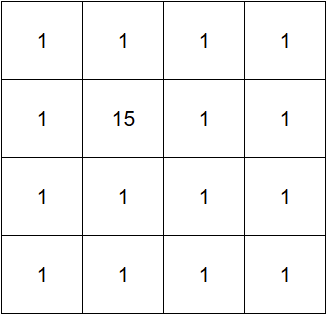
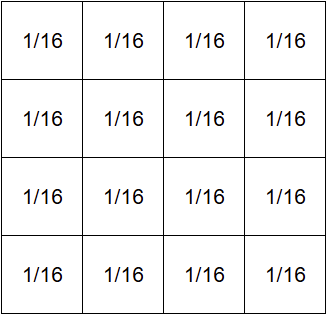
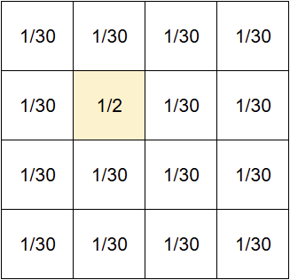
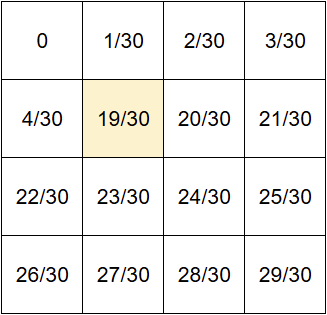
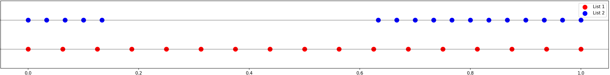
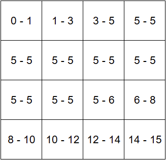
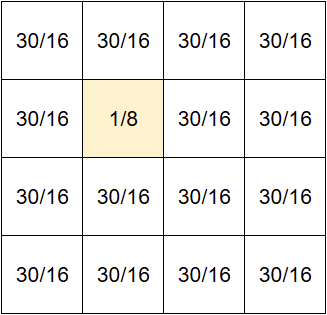
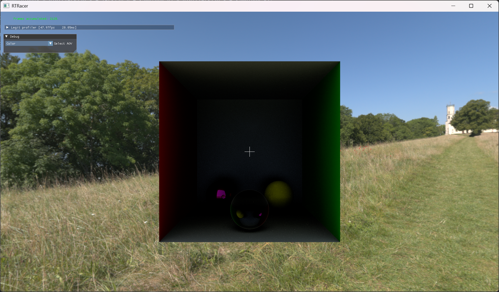

When sampling IBL some samples are move "valuable" than others. Take the Sun, for instance.
In an ".exr" image its luminosity might be more than 100000 watts, while its solid angle is only around 0.0005% of the
area of the whole sky sphere. That means that:
 - ray will almost never hit the Sun's bright texels, thus there will be no shadow from the Sun. 
 - rays that "lucky" enough to hit the Sun will look more like a firefly.

To solve this issue we introduce IBL importance sampling.

Let's say we have an environment image - "InitialIBL" - with the following absolute luminosity values. \
*InitialIBL* \


The PDF (Probability Density Function) - probability of sampling any texel is uniform.
The average result would be total sum of all sampled values divided by number of samples. For 16 samples that would be:
>Avrg = 30 / 16 = 1.875

If we want to sample some values more often that others,
we have to change the PDF that we use for sampling.
For this purpose we need to create a new texture that will assign each texel a new probability
of it being sampled depending on the texel's raw value.

If the default <mark>uniform</mark> PDF looks like this:

*DefaultDistribution* \


the new <mark>nonuniform</mark> one would look like this:

*NonuniformDistribution* \


In this case, each texel's probability of being sampled is equal to its value divided by the total sum of all values.
>15 / 30 = 1 / 2 for the 5th texel and \
> 1 / 30 for all other texels

We have to create a UV texture that would help us map a <mark>uniform</mark> UV sampling to the new <mark>nonuniform</mark> one.
For this purpose we need to create a CDF (Cumulative Distribution Function) based on the nonuniform PDF. \
*CDF* \
 \

Then we create a margin map that for every pixel in <mark>nonuniform</mark> map will give us margin of pixel indices
in <mark>uniform</mark> IBL image. Here's the code with comments that uses two pointers to build that margin map.

```c++
struct FMargin
{
	FMargin() {};
	FMargin(uint32_t L, uint32_t R) : Left(L), Right(R) {};
	uint32_t Left;
	uint32_t Right;
};

/// Map of margins that later will be use as a texture
std::vector<FMargin> IBLSamplingMap(Width * Height);
double Stride = 1. / double(Width * Height);
uint32_t Slow = 0;
uint32_t Fast = 0;

for (int i = 0; i < IBLSamplingMap.size(); ++i)
{
	/// We get the left and right values of a uniform distribution margins
	double Left = i * Stride;
	double Right = (i + 1) * Stride;

	/// Iterate Slow until it enters the margin
	while (Slow < PixelsCount && LuminosityCDF[Slow] <= Left)
	{
		Slow++;
	}

	/// Iterate Fast until it leaves the margin
	while (Fast < PixelsCount && LuminosityCDF[Fast] <= Right)
	{
		Fast++;
	}

	/// Record the margin. Slow - 1 is the index of texel that "enters" the margin and Fast - 1 is the index of pixel that leaves the margin
	IBLSamplingMap[i] = {Slow - 1, Fast - 1};
}
```
Here are the plot of <mark>uniform</mark> and <mark>nonuniform</mark> margins for visualisation:\
*Margins* \
 \

And here's the resulting "Map": \
*Map* \


As you can see, almost half of the map will tell you to sample the 5th texel (The one with "15" value).

Now, the problem is that the average has changed. Nonuniform PDF map with 16 samples will result normally in 8 samples
being sampled from the 5th texel (15) and 8 from other texels. The resulting average would be:
> Avrg = (15 * 8 + 1 * 8) / 16 = 8

To fix that we have to add weights map, so that sample would be multiplied by that weight.
The weight map is actually pretty simple.
It's just the ratio of <mark>uniform</mark> PDF to the <mark>nonuniform</mark> PDF. \
So, the weighs map will look like this: \
*Weights* \


Now, when we sample any value, we multiply it by corresponding weight. Returning back to sampling nonuniform map 16 time the new result would be:
> Avrg = (15 * 8 * (1 / 8) + 1 * 8 * (30 / 16)) / 16 = 1.875

The resulting average matches the uniform one.

So now, when we sample an IBL with a uniform UV coordinates, we fetch the interval from the Margins map,
choose a new texel from the interval and use new texel's value multiplied by the appropriate weight.
Here's the result of the uniform sampling and the importance sampling.

*Uniform sampling* \


*Importance IBL sampling* \


