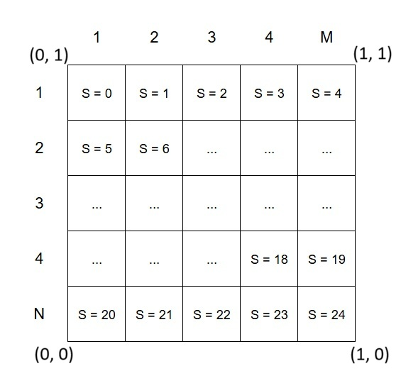
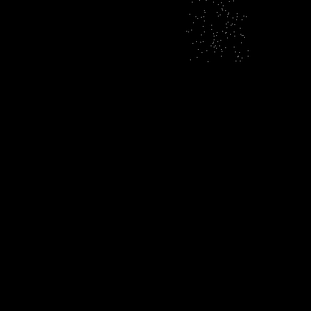
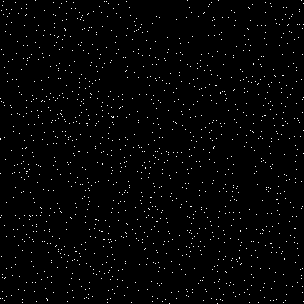
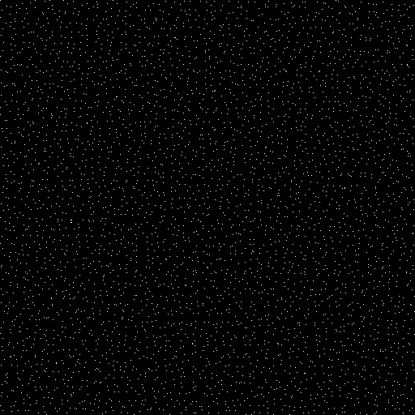
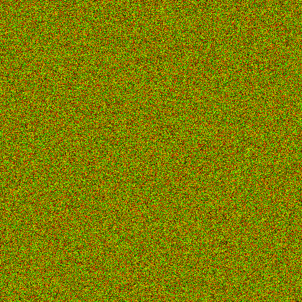

In the [cmj.pdf](https://graphics.pixar.com/library/MultiJitteredSampling/paper.pdf) you can find Pixar's
explanation on how correlated multi-jittered sampling works. \
Here's a brief description of function parameters: \
`CMJ(int s, int m, int n, int p)` - is the function that will be used.

`s` - defines the index of stratum that will be used to generate random sample \
`n`, `m` - the number of rows and columns that a unit square will be partitioned into \
`p` - permutation index.

*UnitSquareDescription* \


Let's see how it all works. \
For example, this is what would happen if we call `CMJ` with constant `s` = 3, `m` = 5, `n` = 5 and varying `p` from 0 to 100

*SampledUnitSquare* \


As you can see we sampled 100 values from 4th stratum.

To see the advantage of stratified sampling lets compare it to a random one. \
<mark>RandomSamples</mark> shows 4096 random samples with standard mt19937 generator \
<mark>CMJSamples</mark> shows 4096 `CMJ` samples with a grid size of 64.

*RandomSamples* \


*CMJSamples* \


It is noticeable that with a CMJ sampling algorithm, the distribution of samples is more even, and it doesn't contain
any clumps or voids. This is due to the fact that each of 4096 strata contains exactly 1 sample.

Now, to add CMJ to the engine, first we have to understand which CMJ's parameters will vary \
and what renderer's parameters should influence the CMJ's result;

As for the CMJ's parameters: \
 - `n`, `m` - will be the constant and `n = m`. They just define the amount of strata in a uniform square.
 - `s` - index of a strata within which bounds a random sample will be generated.
Each frame, each pixel, each bounce and each invocation should have a different `s`.
The order should be shuffled from call to call, but the distribution should be uniform.
 - `p` - permutation index. Should change after all strata have been used.

As for rendering parameters that we have:
 - Render iteration
 - Pixel index
 - Bounce index
 - Invocation index - in case we need to call CMJ more than one time with all the other parameters being the same 
 - Ray type - to be able to set different "starting" permutation points for different types of rays

With all this data we can devise a formula for stratum selection based on sample's `RenderIteration` and `PixelIndex`:
```c++
uint32_t NM = n * m;
uint32_t StratumIndex = Permute((PixelIndex * 524287 + RenderIteration) % NM, NM, (PixelIndex * 524287 + RenderIteration) / NM);
```
We'll use provided by Pixar Permute function for this.

We can run calls of this function like this:
```c++
std::vector<int> StrataVector(16);
for (int i = 0; i < 256; ++i)
{
	for (int j = 0; j < 256; ++j)
	{
		uint32_t StrataIndex = Permute((i * 524287 + j) % 16, 16, (i * 524287 + j) / 16);
		StrataVector[StrataIndex]++;
	}
}
for (int i = 0; i < StrataVector.size(); ++i)
{
	std::cout << StrataVector[i] << ' ';
}
```
And get the following output:
>4102 4088 4108 4090 4098 4098 4088 4104 4090 4104 4084 4102 4094 4094 4104 4088

This shows that while the distribution is not perfect, the deviation is rather small, which is great!

Now, slightly modify the code to see the output for a single pixel, but with `RenderIteration` going from 0 to 255:
```c++
int Pixelindex = 3;
for (int i = 0; i < 256; ++i)
{
	uint32_t StrataIndex = Permute((i * 524287 + Pixelindex) % 16, 16, (i * 524287 + Pixelindex) / 16);
	std::cout << StrataIndex << ' ';
	if (i % 16 == 15) { std::cout << std::endl;}
}
```
The output:
>11 14 9 3 12 15 10 7 3 13 5 2 4 8 7 10 \
9 12 2 5 6 4 3 11 4 9 2 7 9 0 11 3 \
0 13 7 2 7 11 9 0 2 13 4 5 1 14 0 9 \
10 7 5 4 15 3 0 6 3 8 1 13 8 11 6 0 \
11 14 13 1 9 4 10 6 4 12 14 7 12 11 2 3 \
11 0 1 13 5 13 7 8 12 9 4 14 2 6 15 11 \
0 5 10 3 9 10 11 5 10 2 1 4 2 7 15 12 \
7 13 0 8 4 0 2 8 7 10 5 13 11 3 12 1 \
15 4 6 9 8 11 14 6 7 12 3 9 5 1 6 14 \
0 8 9 3 5 2 4 7 2 13 6 0 13 9 7 4 \
9 14 0 6 14 10 11 7 3 9 0 4 5 2 7 11 \
6 14 4 0 6 15 4 13 15 10 2 1 10 12 13 4 \
12 7 1 2 8 13 11 10 13 0 5 9 0 7 14 2 \
7 1 15 6 9 4 3 7 5 10 11 2 1 8 0 15 \
14 9 6 12 5 14 4 7 14 11 0 8 11 6 13 3 \
6 1 12 9 6 15 9 4 8 3 1 14 2 7 0 10

Some rows might contain a duplicate, but in general it's a rather uniformly spread.

And, to check how the function behaves within the same `RenderIteration`, run in with `PixelIndex` running from 0 to 255:
```c++
int RenderIteration = 3;
for (int i = 0; i < 256; ++i)
{
	uint32_t StrataIndex = Permute((RenderIteration * 524287 + i) % 16, 16, (RenderIteration * 524287 + i) / 16);
	std::cout << StrataIndex << ' ';
	if (i % 16 == 15) { std::cout << std::endl;}
}
```
The result is also good:
>9 14 12 3 9 8 1 6 0 7 14 2 10 15 13 12 \
4 11 5 10 4 2 9 1 7 15 8 11 3 14 0 5 \
13 6 12 10 3 5 11 9 0 8 2 1 15 4 12 13 \
7 14 6 4 11 12 6 1 10 3 9 0 2 13 5 8 \
14 7 15 10 4 11 2 7 13 12 5 0 8 15 9 6 \
14 3 1 5 11 3 12 14 8 6 13 9 1 10 0 15 \
7 2 4 13 4 12 6 14 7 9 15 1 11 2 10 5 \
3 8 0 5 14 7 13 8 15 0 10 12 2 11 3 4 \
6 1 9 10 2 7 5 4 12 3 13 11 1 0 9 14 \
8 15 6 3 11 6 8 13 5 14 4 2 12 10 1 9 \
15 7 0 9 7 12 4 5 15 6 14 2 11 13 3 1 \
8 0 10 8 10 5 13 0 6 15 7 12 3 4 14 9 \
2 11 1 8 0 7 1 14 6 11 9 2 12 3 10 15 \
5 4 13 1 9 2 8 7 15 10 12 13 3 11 4 6 \
0 14 5 9 3 10 2 13 11 0 8 5 12 4 14 6 \
15 1 7 4 10 3 11 12 14 9 1 13 6 15 5 0

What we needed!

And last but not least - we need to generate a permutation index for CMJ function. \
It will depend on 4 variables:
 - `Type` - a very big offset that defines a starting point for a permutation. \
For example 0x10000000 - for permutations that used in ray generation shader and \
0x20000000 - for permutation used in IBL light sampling shader
 - `RenderIteration`
 - `BounceIndex`
 - `Generation` - to distinguish from previous call if it's the same bounce and render iteration \

So the formula will look like this:
```c++
uint32_t PermutationIndex = SamplingState.Type + SamplingState.RenderIteration * 256 + SamplingState.Bounce * 16 + SamplingState.Generation;
```
It assumes that in one bounce no more than 16 cmj call will be used, no more than 16 bounces in one render iteration, \
and that there would be no more that 1kk render call for each Type. If, for example, Generation exceeds 16,\
then the permutation index will be the same as first call on the next bounce.
So, the final function to sample a uniform quad will look like this:
```c++
FVector2 Sample2DUnitQuad(inout FSamplingState SamplingState)
{;
	uint32_t StratumIndex = Permute((SamplingState.PixelIndex * 524287 + SamplingState.RenderIteration) % CMJ_TOTAL_GRID_SIZE, CMJ_TOTAL_GRID_SIZE, (SamplingState.PixelIndex * 524287 + SamplingState.RenderIteration) / CMJ_TOTAL_GRID_SIZE);
	uint32_t PermutationIndex = SamplingState.Type + SamplingState.RenderIteration * 256 + SamplingState.Bounce * 16 + SamplingState.Generation;
	SamplingState.Generation += 1;
	return CMJ(StratumIndex, CMJ_GRID_LINEAR_SIZE, CMJ_GRID_LINEAR_SIZE, PermutationIndex);
}
```

Here's the example of how a single frame of Sample2DUnitQuad might look like: \

*Sample2DUnitQuad* \


Furthermore, Sample2DUnitQuad function can be used to generate more complex functions, like sample unit disk, or unit sphere.
