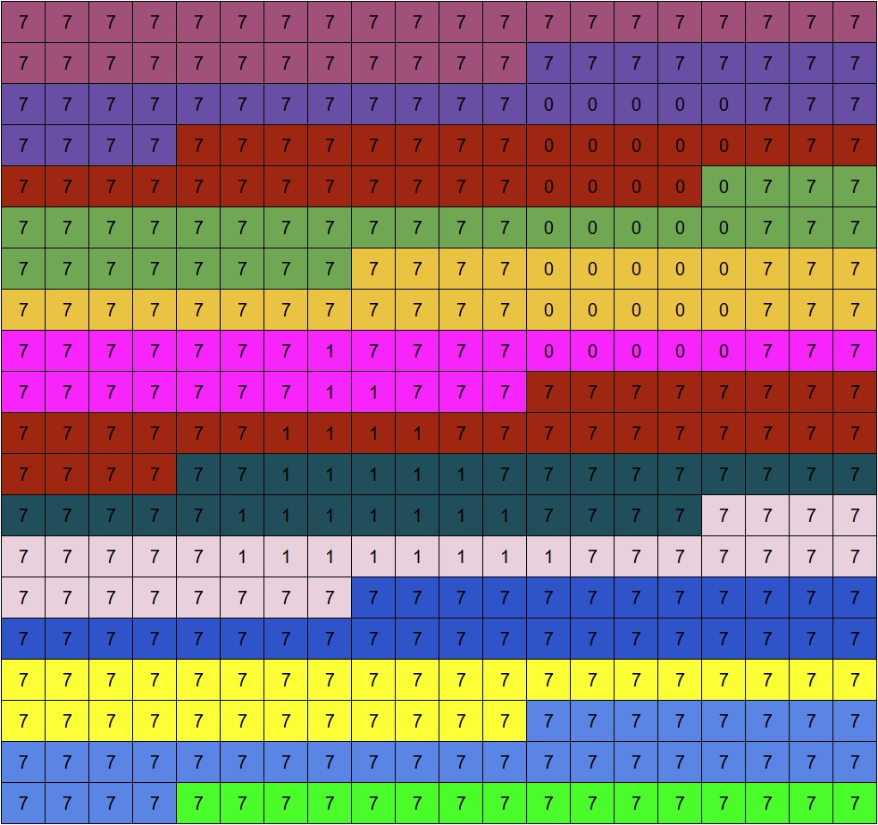

Let's say we have a picture 20x20 with two shapes and each of them has a different material. Something like this:

*OriginalImage*

For simplification, the maximum number of material will be 8,
with the 8th one reserved for cases when ray misses the geometry (skybox material).

The first step of sorting materials is generating material ID map. It will look like this:

*MaterialIdMap*

Then, we need to calculate the entry of each material. But this will be done in chunks. Each chunk will cover 32 pixels.
For a 20x20 image we need 13 chunks. However, to simplify prefix sum computation, we allocate a power of 2 chunks, which is 16.
Each chunk will have 8 `uint` counters (one for each material).

Chunks partition will look like this:

*ChunkPartitionedOriginalImage*

After all the materials are counted in each chunk, we'll have a <mark>ChunkToMaterialCounted</mark> buffer like this:

*ChunkToMaterialCounted*

> Coloring here is only to show where each shape contributed.

The last row (material 7) represents skybox materials, where rays didn't hit any geometry.

Then we calculate prefix sum for every material. It is done on GPU in place. [See chapter 39 in GPU Gems 3 ](https://developer.nvidia.com/gpugems/gpugems3/part-vi-gpu-computing/chapter-39-parallel-prefix-sum-scan-cuda)

After prefix sum has been calculated, the <mark>ChunkToMaterialCounted</mark> buffer will look like this

*ChunkToMaterialCounted*

Also, while calculating the prefix sum, we count how many entries of each material are there in total. This will be stored in <mark>CountedMaterialsBuffer</mark>.
This will make it possible to use this buffer as source for vkCmdDispatchIndirect. Each entry is actually a vec3 where x is materials count and y and z equals to 1.

*CountedMaterials*

Then we create an additional buffer for prefix sum of counted materials - <mark>MaterialsOffsets</mark> buffer.

*MaterialsOffsets* \

Now we are ready to generate a texture that will map a sorted pixel index to the original one. \
To do so we run a compute shader for every pixel. In shader we:
1. Get pixel index: \
`uint PixelIndex = gl_GlobalInvocationID.x;`
2. Get the chunk index: \
`uint ChunkIndex = PixelIndex / BASIC_CHUNK_SIZE;` (BASIC_CHUNK_SIZE = 32 in out case)
3. Get the material index: \
`uint MaterialIndex = MaterialIdMap[PixelIndex];`
4. Now we get the material's offset from chunk-to-material-counted buffer and simultaneously increase it by 1 with atomicAdd: \
`uint NewRelativeIndex = atomicAdd(ChunkToMaterialCounted[MaterialIndex * PushConstants.MaxGroupSize + ChunkIndex], 1);` \
this will be the number relative to the starting index of the material
5. Now we need to calculate new absolute pixel index. \
Just add the relative one to the starting one from  <mark>MaterialsOffsets</mark> buffer: \
`uint NewRayIndex = MaterialsOffsets[MaterialIndex] + NewRelativeIndex;`
6. Save the result in <mark>NewToOldPixelMap</mark>: \
`NewToOldPixelMap[NewRayIndex] = PixelIndex;`

After this you will have texture that looks like this: \
(The order of indices inside the material might be different because of concurrency, \
but, all the indices inside the material group will refer to the indices of the appropriate material)

Now everything is ready. When you decide to render all pixels that hit a particular material - lets say second material (the triangle's material)
You call vkCmdDispatchIndirect with <mark>CountedMaterials</mark> buffer and offset apropriate to that material. \
In our case the offset is `MaterialIndex * 3 * sizeof(uint32_t)`, which will result in 1 * 3 * 4 = 12 bytes. \
It will point here:

*CountedMaterials*

This way the compute shader will be executed 27 times in x, 1 in y and 1 in z "dimentions", which is actually the amount of pixels in the triangle

In shader we have access to material index, gl_GlobalInvocationID.x and <mark>NewToOldPixelMap</mark>. \
With this we can obtain the original pixel index. To do so: \
1. Generate the "new" pixel index. Fetch data from MaterialsOffsets buffer and add gl_GlobalInvocationID.x to it \
(gl_GlobalInvocationID.x runs from [0 to 26]) \
`uint PixelIndex = MaterialsOffsets[PushConstants.MaterialIndex] + gl_GlobalInvocationID.x;`
2. Fetch the "original" pixel index from <mark>NewToOldPixelMap</mark>: \
`uint NewPixelIndex = NewToOldPixelMap[OriginalPixelIndex];`

And it's done. Now you have the pixel from original image with that material!

>P.S. To account for multiple bounces, we need to add additional material, that will indicate that ray missed any geometry on the previous bounce,
and we don't want to compute any shading information from such ray.
The sorting goes as usual, but when the time comes to shade rays associated with this "void" material,
we just skip it. Thus, I suggest making this material the last.
In out example, the sky material gets id = 6 and the "void" material gets id = 7.